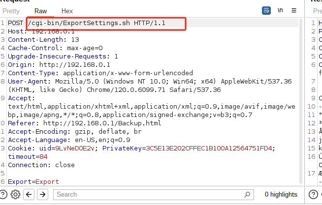
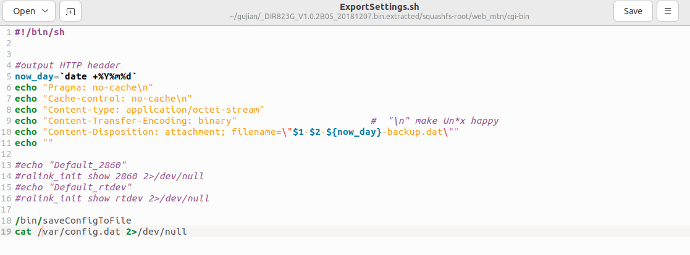
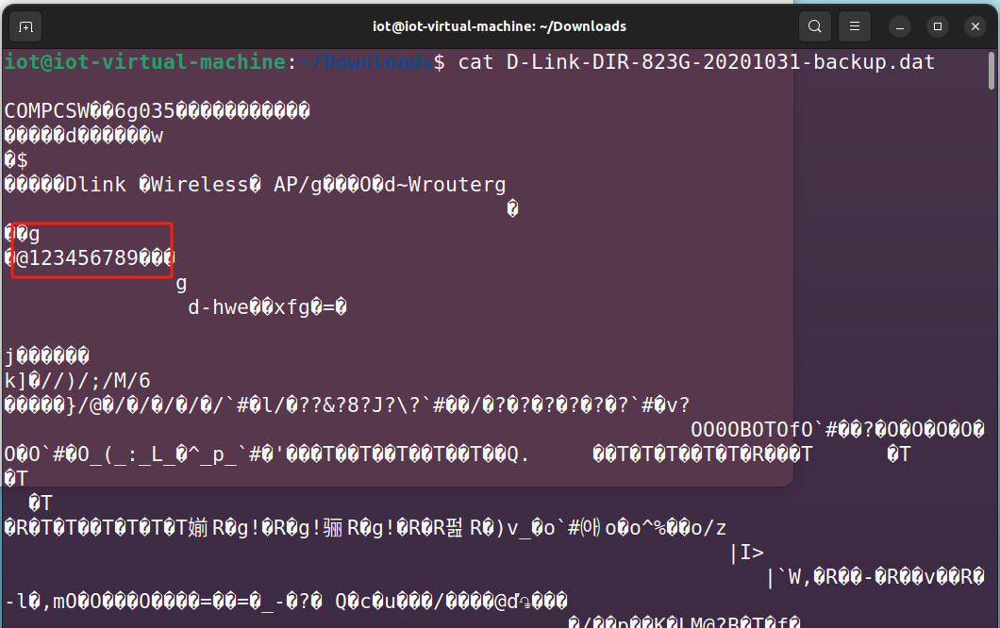
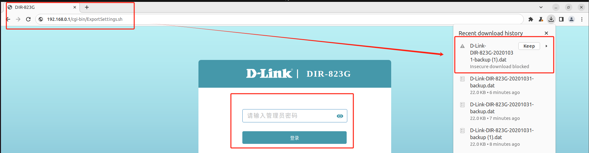
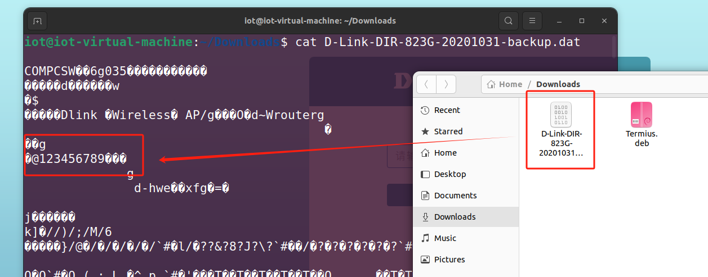

# DIR-823G Serious Information Leak

Firmware Name：DIR823G_V1.0.2B05_20181207

Firmware Download：http://www.dlink.com.cn/techsupport/ProductInfo.aspx?m=DIR-823G(B)

# Description:
The device has unauthorized configuration file downloads, and the downloaded configuration files contain plaintext user passwords. Note: The test device is no longer in use.

# Analysis：
We conducted packet capture while downloading configuration information.

Upon analysis, it was found that this file can be accessed without authorization, meaning the configuration information for the device can be downloaded without permission, and the user passwords in this configuration are displayed in plaintext.

# poc

