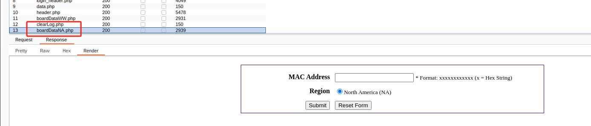
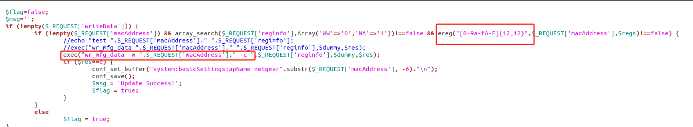
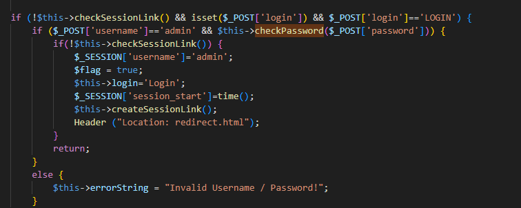
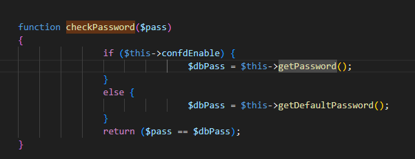
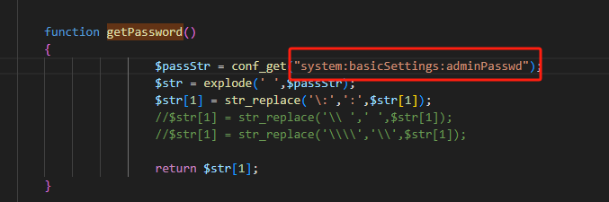
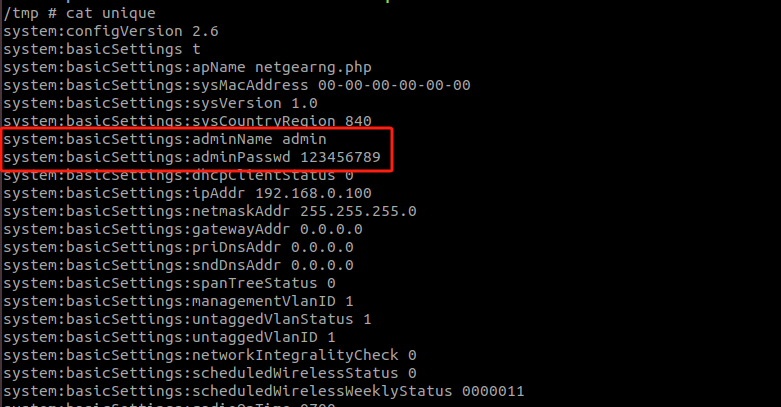
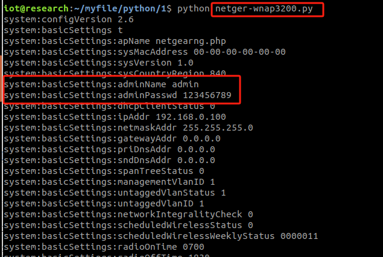

# Netgear WNAP 320

# Firmware：

[WNAP320-Firmware-Version-3-7-11-4](https://kb.netgear.com/000060419/WNAP320-Firmware-Version-3-7-11-4)

# Description：

The device has a vulnerability that leads to information leakage, with important data such as account passwords for admin and user privileges displayed in plaintext and in the same format, without encryption protection. Additionally, there is an unauthorized command execution vulnerability, allowing attackers to execute malicious commands. With the information leakage, attackers can gain admin privileges and make malicious changes to the device. Note: This test device is a decommissioned one.

# Analyse：
## 0x1
First, by accessing all the front-end pages of the device, an unauthorized accessible page called boardDataNA.php was found.

By analyzing, it was found that the page has inadequate filtering of commands, which can lead to the execution of malicious commands.

## 0x2

By capturing packets from the login verification page and analyzing the code, we learned the storage format of the password and other information. Upon searching, we discovered that sensitive information is stored in the unique file within the tmp directory.

# exp

# Modification suggestions:
1. It is recommended to encrypt passwords.
2. Modify the regular expression filtering for the pages.

