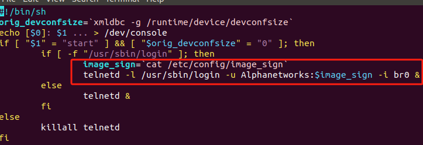
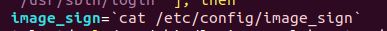
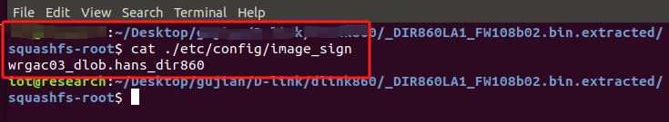
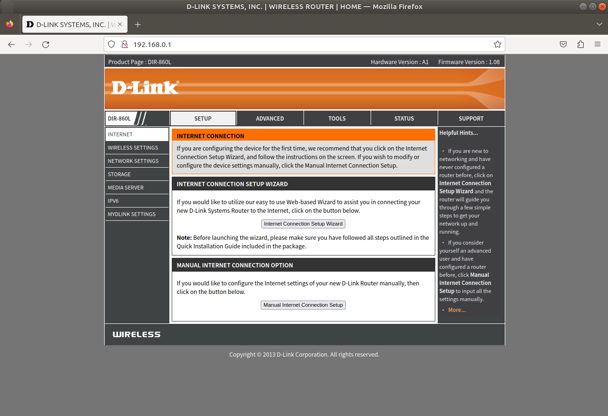
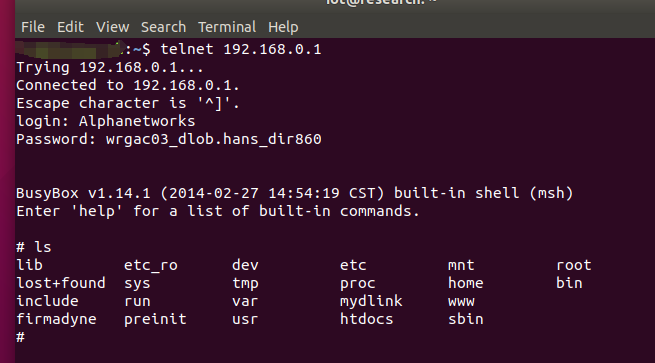

# DIR-860L_REVA_FIRMWARE_hardcode_password

# Firmware:
[DIR-860L_REVA_FIRMWARE_1.08B02.ZIP](https://support.dlink.com/resource/products/DIR-860L/REVA/DIR-860L_REVA_FIRMWARE_1.08B02.ZIP)

# Description:

System initialization, telnetd service started, account and password hard coded.

# Analyse：

Firstly, we can see that the login account is Alphanetworks, and the password is a parameter: image_sign.

Password: "image_sign" is obtained by running the command: cat /etc/config/image_sign. As shown in the figure below.

After executing the command, go to telnet hard code: wrgac03_dlob.hans_dir860

Simulate the launch of the website

Then connect to the website via telnet

